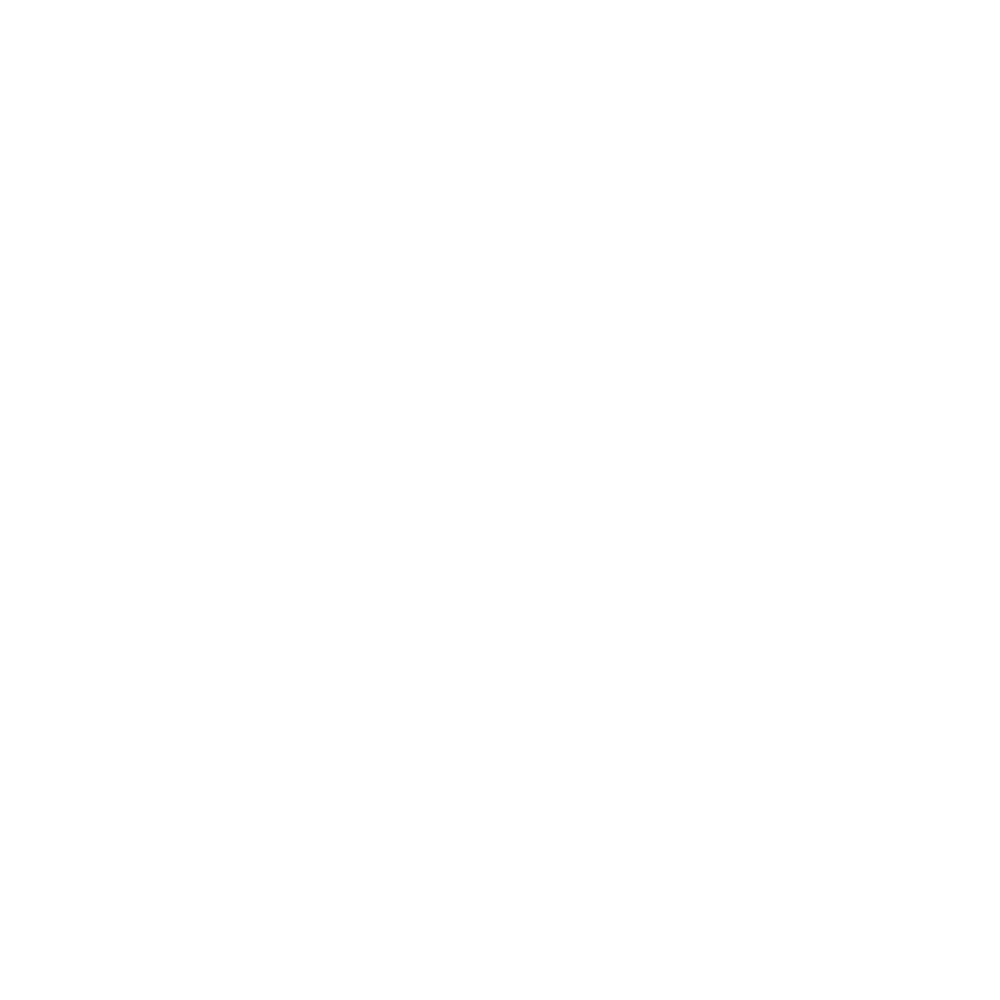

# 🕵️ FindMyStuff
> *The Premium Lost & Found Solution for the Modern Web.*


<div align="center">
  <video src="./public/preview.mp4" width="100%" controls autoplay loop muted></video>
</div>

---

## 📖 Overview

**FindMyStuff** is a next-generation **Progressive Web App (PWA)** designed to bridge the gap between lost items and their owners. Built with privacy and ease-of-use at its core, it leverages geolocation, AI-enhanced matching, and a secure verification system to ensure items are returned safely.

Whether you've lost a wallet in a cafe or found a set of keys in the park, **FindMyStuff** provides the tools to connect, verify, and resolve.

---

## ✨ Key Features

### 🔍 For Finders & Owners
- **📍 Geolocation Mapping**: Interactive Leaflet maps to pinpoint exactly where items were lost or found.
- **📸 Smart Reporting**: Upload images via `Cloudinary` with sensitive area masking to protect privacy.
- **🛡️ Claim System**: A robust claim verification process. Finders can review claims with detailed questionnaires and evidence scoring.
- **💬 Masked Chat**: Privacy-first communication. Chat with the other party without revealing your personal phone number or email, powered by **Server-Sent Events (SSE)**.

### 🔐 Security & Trust
- **🤖 Bot Protection**: Integrated **Cloudflare Turnstile** to prevent spam and fake reports.
- **🚦 Rate Limiting**: Advanced API protection using **Upstash Redis** to prevent abuse.
- **✅ Reputation System**: Users earn badges and trust scores for successful handoffs.
- **🔑 Secure Auth**: Powered by **NextAuth.js** (Google OAuth + Credentials).

---

## 🛠️ Tech Stack

| Category | Technology | Description |
| :--- | :--- | :--- |
| **Framework** |  | **Next.js 14** (App Router) |
| **Language** |  | Type-safe development |
| **Database** |  | **Supabase** (Migrated from Mongo) |
| **Styling** |  | Modern utility-first CSS |
| **Maps** |  | Interactive Maps |
| **Rate Limit** |  | **Upstash** Cloud Redis |
| **Images** |  | Image Management |

---

## 📂 Project Structure

```bash
📦 src
 ┣ 📂 app
 ┃ ┣ 📂 api            # ⚡ Backend API Routes (Claims, Auth, Chat)
 ┃ ┣ 📂 (auth)         # 🔐 Authentication Pages
 ┃ ┣ 📂 dashboard      # 📊 User Dashboard
 ┃ ┗ 📂 feed           # 📊 User Dashboard
 ┗ 📂 models           # 🗄️ Prisma Data Models
```

---

## 🚀 Getting Started

### Prerequisites
- **Node.js** 18+
- **Supabase** Project (PostgreSQL)
- **Google OAuth** Credentials
- **Cloudinary** Account
- **Upstash** Redis Database

### Installation

1.  **Clone the repository**
    ```bash
    git clone https://github.com/Vijayshreekrishna/FINDMYSTUFF.git
    cd FINDMYSTUFF
    ```

2.  **Install dependencies**
    ```bash
    npm install
    # or
    pnpm install
    ```

3.  **Configure Environment**
    Copy the template and fill in your secrets.
    ```bash
    cp .env.example .env.local
    ```

4.  **Run Development Server**
    ```bash
    npm run dev
    ```
    Open [http://localhost:3000](http://localhost:3000) to view it in the browser.

---

## 🌿 Environment Variables

Ensure your `.env.local` is populated:

```env
# Database
DATABASE_URL="postgresql://..."

# Auth
NEXTAUTH_URL="http://localhost:3000"
NEXTAUTH_SECRET="your-secret"
GOOGLE_CLIENT_ID="..."
GOOGLE_CLIENT_SECRET="..."

# Services
NEXT_PUBLIC_CLOUDINARY_CLOUD_NAME="..."
RESEND_API_KEY="..."
UPSTASH_REDIS_REST_URL="..."
NEXT_PUBLIC_TURNSTILE_SITE_KEY="..."
```

---

## 🚢 Deployment

The application is optimized for **Vercel**.

[](https://vercel.com/new/clone?repository-url=https%3A%2F%2Fgithub.com%2FVijayshreekrishna%2FFINDMYSTUFF)

For detailed deployment steps, please check [documentation/deployment.md](./documentation/deployment.md).

**Live Demo**: [https://findmystuff.vercel.app](https://findmystuff.vercel.app)

---

## 🤝 Contributing

Contributions are what make the open source community such an amazing place to learn, inspire, and create. Any contributions you make are **greatly appreciated**.

1.  Fork the Project
2.  Create your Feature Branch (`git checkout -b feature/AmazingFeature`)
3.  Commit your Changes (`git commit -m 'Add some AmazingFeature'`)
4.  Push to the Branch (`git push origin feature/AmazingFeature`)
5.  Open a Pull Request

---

## 📄 License

Distributed under the MIT License. See `LICENSE` for more information.

---

## ✍️ Author

<div align="center">
  <strong><a href="https://github.com/Vijayshreekrishna">Vijayshreekrishna</a></strong>
</div>

<div align="center">
  <br /> 
  <a href="https://linkedin.com/in/vijayshreekrishna">LinkedIn</a>
  <br />
</div>

---

<div align="center">
  <small>Guided by <strong><a href="https://github.com/Ayushjain2205">Ayushjain2205</a></strong></small>
  <br />
  
  <br />
</div>